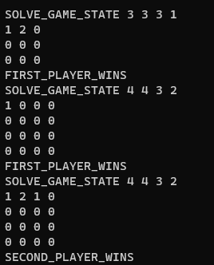
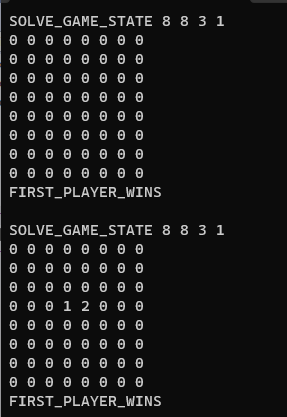

# Task Description

The task consists of three parts:

- Implementing a generalized version of the Tic Tac Toe game engine.
- Implementing a program that solves this game using the Minimax algorithm.
- Implementing a program that solves this game using the Proof Number Search algorithm.

The primary objective of this task is to explore numerical optimization mechanics. The Minimax algorithm and Proof Number Search algorithm will be utilized to solve the Tic Tac Toe game.

## Tic Tac Toe Game Engine

The first part of the task requires implementing a generalized version of the Tic Tac Toe game engine. The engine should be able to handle games with varying sizes and win conditions.

## Minimax Algorithm

The second part of the task involves implementing a program that solves the Tic Tac Toe game using the Minimax algorithm. The Minimax algorithm is a decision-making algorithm used for two-player zero-sum games. It involves searching through the game tree to determine the best move for a player.

- The Minimax algorithm include checking deep (K-1).
- The Minimax algorithm include alpha-beta optimization.

## Proof Number Search Algorithm

The third part of the task involves implementing a program that solves the Tic Tac Toe game using the Proof Number Search algorithm. The Proof Number Search algorithm is a game tree search algorithm that is designed to handle games with large branching factors.

## Example Tests:

### Min Max example result

### Proof Number Search example result

### More information in txt files